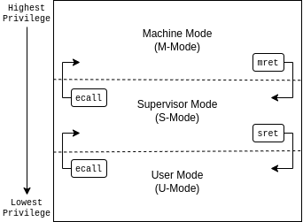
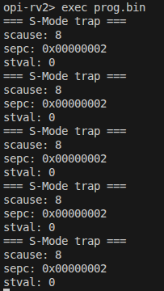
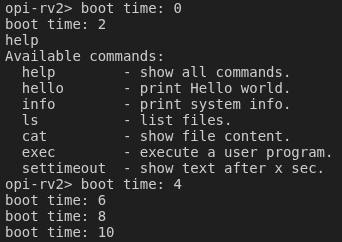
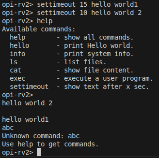

# Lab 4: Exception and Interrupt

## Introduction

An exception is an event that causes the currently executing program to relinquish the CPU to the corresponding handler.
With the exception mechanism, an operating system can

1. handle errors properly during execution,
2. allow user programs to request system services,
3. respond to peripheral devices that require immediate attention.

---

## Goals of this lab

- Understand the exception mechanism in RISC-V.
- Understand how interrupt delegation works in the OrangePi RV2 platform.
- Configure and handle core timer interrupts using the SBI Timer Extension.
- Understand and handle UART interrupts via the PLIC.
- Learn how to multiplex timers and schedule asynchronous tasks.

---

## Background

### Official Reference

Exceptions and interrupts in RISC-V are defined in the official privileged specification. For details, see:

- RISC-V Privileged Architecture Manual: https://github.com/riscv/riscv-isa-manual/releases

---

## Exception Levels (Privilege Modes)

RISC-V defines privilege modes to isolate different system components.
In our OS design, the kernel executes in **Supervisor mode (S-mode)**, while user applications execute in **User mode (U-mode)**.



In this lab, you will run both kernel and user-mode programs, using `sret` to switch from S-mode to U-mode, and configuring trap handling via the following CSRs: `stvec`, `sscratch`, `sepc`, `scause`, and `sstatus`.

---

## Supervisor Control and Status Registers (CSRs)

RISC-V provides dedicated CSRs to manage and observe the state of traps (exceptions and interrupts). To implement a robust trap handler in S-mode, you are expected to independently consult the RISC-V Privileged Specification to understand the precise roles and hardware behaviors of the following key registers:

`sstatus`, `stvec`, `sepc`, `scause`, `stval`, `sscratch`, and `sie`.

> 💡 **Hint**  
> Before diving into the code, ensure you clearly understand what information the hardware automatically writes to these registers when a trap occurs, and which registers are read by the hardware when the `sret` instruction is executed.

---

## Core Timer and SBI

In S-mode, the kernel relies on the Supervisor Binary Interface (SBI) to manage timer interrupts.

Key concepts for S-mode timers:

- `time` CSR: A 64-bit read-only register that reflects the current timer value (accessible via the `rdtime` instruction).
- SBI Timer Extension: To schedule a timer interrupt, the S-mode kernel must call `sbi_set_timer(uint64_t stime_value)`.

---

## Interrupt Controllers – PLIC

OrangePi RV2 uses the **Platform-Level Interrupt Controller (PLIC)** to handle external interrupts from devices such as UART.

Key facts:

- Each device interrupt has an ID.
- PLIC routes interrupt requests to CPU cores with a priority mechanism.
- Each hart has context-specific registers to claim/complete interrupts.

---

## Critical Sections

As in all interrupt-driven systems, shared data must be protected from concurrent access during interrupt handling.

In RISC-V, this can be done by disabling interrupts via `csrci sstatus, SSTATUS_SIE` and re-enabling via `csrsi`.

---

# Basic Exercises

## Basic Exercise 1 – Exception (30%)

### Mode Switch: S-mode to U-mode

After booting in S-mode, configure registers to switch to U-mode and run user-level programs.

Setup includes:

1. Writing user program address to `sepc`
2. Setting `sstatus` to enable interrupts and select U-mode
3. Using `sret` to jump to U-mode

> ✅ **Todo**  
> Add command `exec` that can load the [user program](images/RISC_privilege.png?raw=1)  
> <https://github.com/nycu-caslab/OSC2026/raw/main/uploads/prog.bin>  
> in the initramfs and run it in U-mode.

---

### Trap Handling from U-mode

When the user program executes an `ecall`, it traps to the S-mode handler. You need to:

- Ensure `stvec` points to your trap handler
- Save user context (`x1–x31`, `sepc`, `sstatus`)
- Print diagnostic info from `scause`, `sepc`, and `stval`
- Restore context and return to user using `sret`

> ✅ **Todo**  
> Set the vector table and implement the exception handler.

Result example:The result would be like this:



---

## Basic Exercise 2 – Core Timer Interrupt (10%)

Timer interrupts are essential for OS scheduling. You will use the Supervisor Binary Interface (SBI) to program the timer. Steps:

1. Read the current time using the `rdtime` instruction.
2. Calculate the target time by adding twice the CPU’s frequency to the current time (this represents 2 seconds).
3. Call `sbi_set_timer(target_time)` to schedule the interrupt.
4. Set the `STIE` bit in the `sie` register to enable timer interrupts.
5. Set the `SIE` bit in `sstatus` to enable global interrupts.
6. When the interrupt triggers (checked via `scause`), print the number of seconds passed since boot.
7. Reprogram the timer for the next 2 seconds using the SBI call again.

> ✅ **Todo**  
> Enable the core timer’s interrupt. The interrupt handler should print the seconds after booting every 2 seconds and set the next timeout to 2 seconds later.

Result example:The result would be like this:



---

## Basic Exercise 3 – UART Interrupt (30%)

Make UART I/O asynchronous using PLIC interrupts and ring buffers.

> ✅ **Todo**  
> Implement the asynchronous UART read/write by interrupt handlers.

---

# Advanced Exercises

## Advanced Exercise 1 – Timer Multiplexing (20%)

Implement a one-shot timer-based timer API.

```c
void add_timer(void (*callback)(void*), void* arg, int sec){
    ...
}
```

Shell command to test:

```text
setTimeout SECONDS MESSAGE
```

> ✅ **Todo**  
> Implement the `setTimeout` command with the timer API.

> ❗ **Important**  
> `setTimeout` is **non-blocking**. Users can set multiple timeouts.  
> The printing order is determined by the command executed time and the user-specified seconds.

Example:



---

## Advanced Exercise 2 – Concurrent I/O Devices Handling (20%)

### Decouple the Interrupt Handlers

> ✅ **Todo**  
> Implement a task queue mechanism so interrupt handlers can enqueue processing tasks.

---

### Nested Interrupt

> ✅ **Todo**  
> Execute the queued tasks before returning to the user program, with interrupts enabled.

---

### Preemption

Task API:

```c
typedef void (*task_callback_t)(void *arg);
void add_task(task_callback_t callback, void *arg, int priority) {
    ...
}
```

> ✅ **Todo**  
> Implement the `add_task` API.
